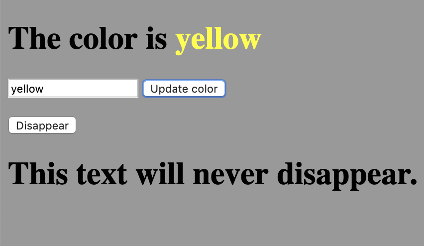

# DOM Manipulation Warm Up

### Instructions

Please complete the following steps. It will be helpful to use jQuery. DO NOT alter any existing HTML code except for adding scripts. 

1. Clone this repository.
1. Create a branch named after your first and last name in kebab case (```firstname-lastname```).
1. In this branch, add and commit a change that will accomplish the following:
    1. When a user types a CSS color name in the input field and hits the update button, the "undefined" text in the first h1 should transform into the name of the color entered and the color of the letters should be that color.
    1. When the user clicks the "Disappear" button, everything on the page except the second h1 should disappear and not come back until after a page refresh.
1. Push your branch to the repo when instructed.
    
    
### Example Images
    
Here is an example of what the page looks after entering "yellow" and clicking the update button:

 
Here is an example of what the page looks after clicking the disappear button:

